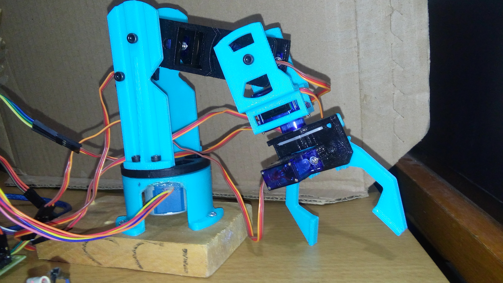

# Brazo Robotico Programable de 5 GDL
## Descripción
El propósito de esta práctica es desarrollar paso a paso un proyecto para controlar y programar un Brazo Robot, 
simulando las funciones básicas de un robot industrial.
El robot debe tener dos funciones básicas
- **Programar:** Registrar las posiciones de los brazos en tres dimensiones (cada registro es un "paso", un programa consiste en una serie de pasos).
- **Ejecutar:** Realice en secuencia las posiciones registradas en el "Programa". El robot ejecutará el programa hasta que se use el comando "ABORTAR".



## Características principales:
- El proyecto se usa para controlar robots con  5 DOF ("Grados de libertad").
- El robot se controla en modo "REMOTO" (a través de una programa en java por medio del puerto serial).
- La información para el usuario se proporciona a través de LEDS de colores, y un sonido (un zumbador).
- Contiene un botón físico de paro de emergencia.
- Si existe un fallo y/o corte de energía, después de restablecerse la corriente el robot debe de continuar el programa (aunque este no se encuentre conectado a la aplicación).
    
Los brazos robóticos se pueden clasificar de acuerdo con el número de "articulaciones" o "Grados de libertad" (DOF) que tienen.
- La "Base", o "Cintura", por lo general puede girar el brazo 360° haciendo uso de un motor a pasos.
- El "Hombro" es el responsable de "levantar o bajar" el brazo verticalmente.
- El "codo" hará que el brazo "avance o retroceda".
- La Muñeca hará que gire la Pinza.
- La "Garra" o "Pinza" funciona abriendo o cerrándose para "agarrar cosas".

## Introducción

Un brazo robótico es un tipo de brazo mecánico, normalmente programable, con funciones parecidas a las de un brazo humano; 
este puede ser la suma total del mecanismo o puede ser parte de un robot más complejo. 
Las partes de estos manipuladores o brazos son interconectadas a través de articulaciones que permiten tanto un movimiento rotacional 
(tales como los de un robot articulado), como un movimiento traslacional o desplazamiento lineal.
El efector final, o mano robótica, se creó para efectuar cualquier tarea que se desee como puede ser soldar, sujetar, girar, etc.,
 dependiendo de la aplicación. Por ejemplo, los brazos robóticos en las líneas de ensamblado de la industria automovilística realizan
 una variedad de tareas tales como soldar y colocar las distintas partes durante el ensamblaje. En algunas circunstancias, lo que se busca es una simulación 
de la mano humana, como en los robots usados en tareas de desactivación de explosivos.

**EEPROM**

(Electrically Erasable Progammable Read Only Memory) Memoria de sólo lectura programable y borrable eléctricamente. 
Chip de memoria que retiene su contenido sin energía. Puede borrarse, tanto dentro del computador como externamente. 
Por lo general requiere más voltaje para el borrado que el común de +5 voltios usado en circuitos lógicos. Funciona como RAM no volátil, pero grabar en EEPROM es mucho más lento que hacerlo en RAM.

## Comenzando 🚀
A continuación se explicarán los pre-requisitos, su instalación, etc.

### Pre-requisitos 📋
**Material físico**:
```
-1 placa arduino (UNO) con su cable para conectar
-piezas para el brazo robótico
-1 Motor a pasos (28byj-48) con su driver UNL2003
-5 Microservomotores (SG90)
-Cables macho-macho, macho-hembra
-Desarmadores pequeños
-2 leds (rojo y verde)
-1 botón (normalmente abierto)
-1 buzzer
-2 resistencias de 330 Ohms
-1 resistencia de 1K
```
**Software**:
```
-1 equipo con:
  -Arduino IDE instalado
  -OpenJDK instalado
  -Netbeans IDE instalado

-Darle permisos dialout al usuario del equipo para arduino (Linux)
-Driver instalado de la placa para arduino (Otros sistemas operativos)
```

## Instalación del sistema 🔧
## Paso 1. Instalar Netbeans 
### Instalación de Netbeans IDE con OpenJDK

**1. Instalar `Open Java Development Kit (OpenJDK)`**
> sudo apt-get install openjdk-8-jdk" 

**2. Verificar versión de Java (OpenJDK) version**
> java -version

**3. Configurar las `variables de desarrollo` para todos los usuarios**
> sudo nano /etc/profile 

  Añadir estas líneas al final del archivo y guardar:
> JAVA_HOME="/usr/lib/jvm/java-8-openjdk-amd64/bin/java" 
> JRE_HOME="/usr/lib/jvm/java-8-openjdk-amd64/jre/bin/java" 
> PATH=$PATH:$HOME/bin:JAVA_HOME:JRE_HOME 

**4. Ejecutar este comando después de guardar cambios**
> ". /etc/profile" 

**5. Checar las variables de desarrollo**
> eecho $JAVA_HOME 
> echo $JRE_HOME

**6. Descargar [Netbeans](https://netbeans.org/downloads/index.html)**

**7. Colocarse en la ruta donde se desargó el archivo.sh de Netbeans**
> cd /Descargas

**8. Ejecutar el archivo netbeans.sh**
> sudo sh netbeans-8.1-linux.sh

**9. Se abrirá la ventana de instalación de Netbeans, cuando llegue a poner la ruta para el jdk, elegir esta**
> /usr/lib/jvm/java-8-openjdk/amd64/”

**10. ¡Listo!**

## Paso 2. Armar circuitos

